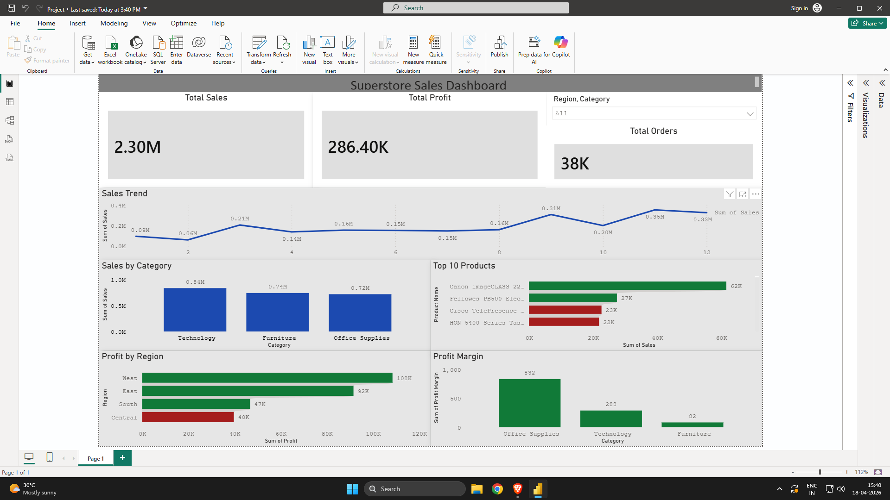

# 📊 Superstore Sales & Profit Dashboard

## 🚀 Overview

This project analyzes retail sales data to uncover insights into revenue, profitability, and regional performance using Power BI.

---

## 🎯 Objective

* Identify top-performing regions and categories
* Analyze sales trends over time
* Highlight profit vs loss areas
* Support business decision-making through visualization

---

## 🛠 Tools & Technologies

* Python (Pandas, NumPy)
* Power BI
* Excel

---

## 📊 Dashboard Features

* KPI Cards (Total Sales, Profit, Orders)
* Monthly Sales Trend
* Sales by Category
* Profit by Region (Profit vs Loss highlighting)
* Top 10 Products
* Profit Margin Analysis

---

## 🔍 Key Insights

* West region generates highest profit
* Central region shows losses → needs attention
* Technology category leads in revenue
* Office Supplies has highest profit margin

---

## 📸 Dashboard Preview

---

## 📁 Files Included

* `superstore.pbix` → Power BI file
* `cleaned_data.csv` → Processed dataset
* `dashboard.png` → Dashboard screenshot

---

## 📌 Conclusion

This dashboard provides actionable insights into sales performance and profitability, helping businesses identify growth opportunities and risk areas.

---
